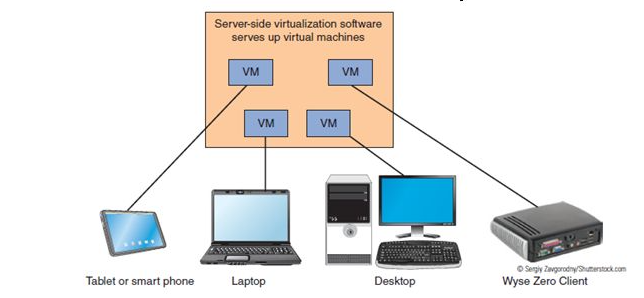
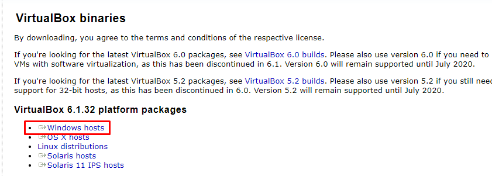
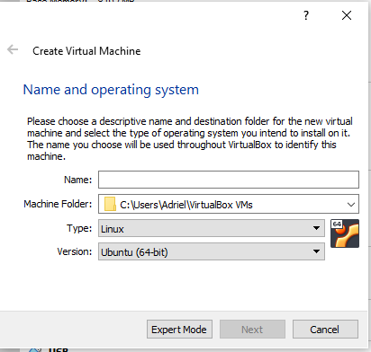
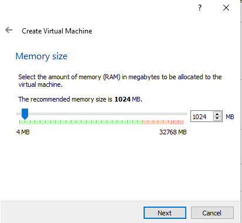
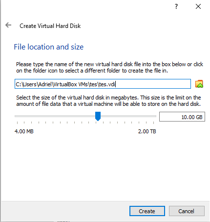
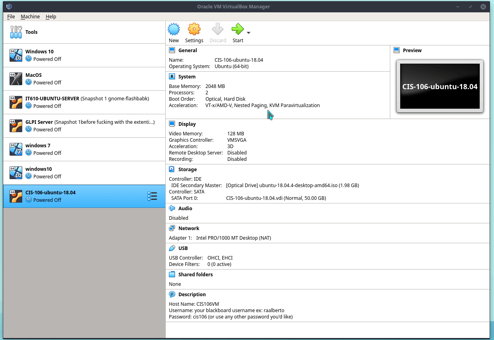
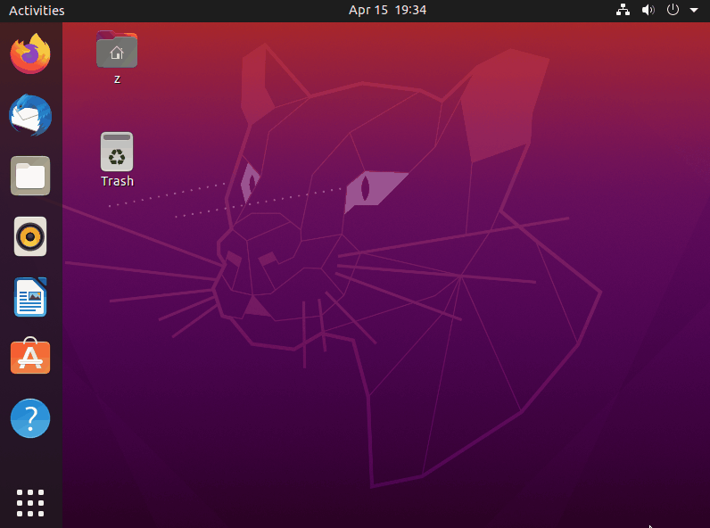
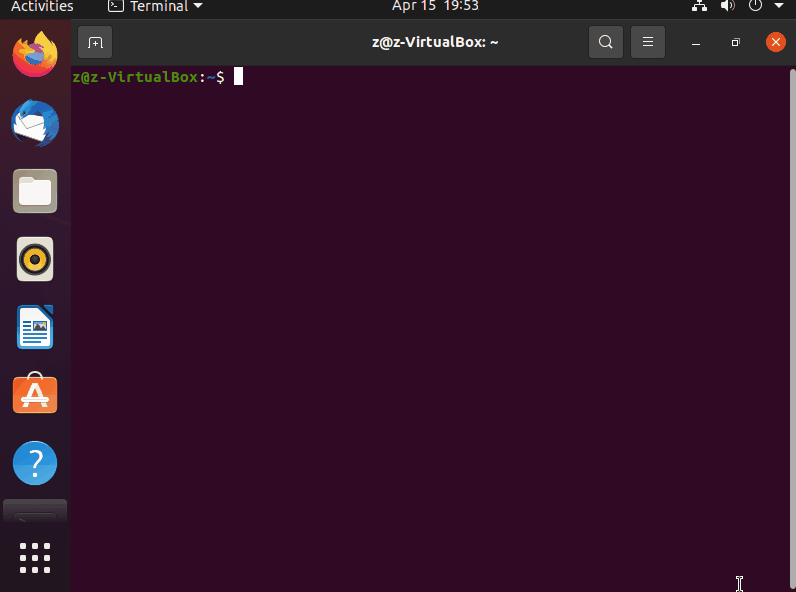
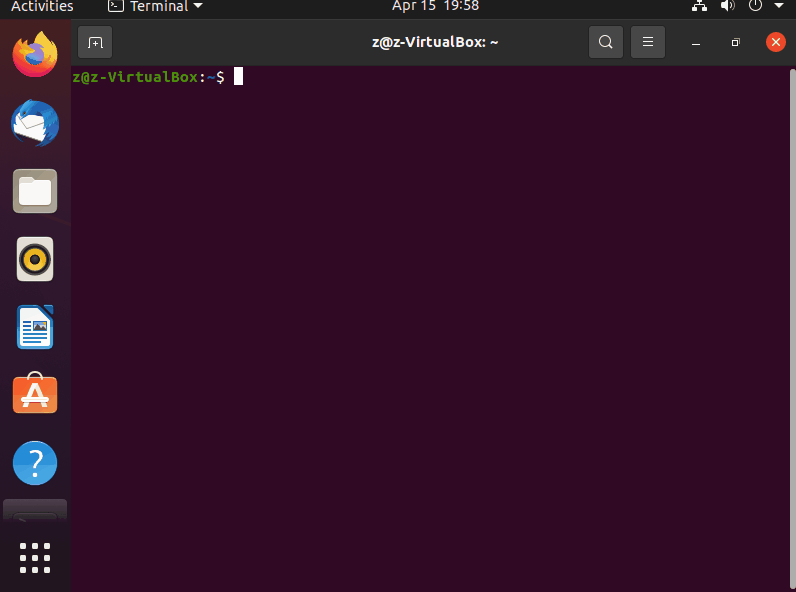

# Deliverable 2

## What is Virtualization?

In basic terms, virtualization is the process of creating virtual objects or systems. As used today, it is commonly employed for creating virtual machines, such as the one we will be creating. However, it can also be used to allocate network resources, or for storage.

Virtualization is made possible by software called **hypervisors**. Hypervisors create and manage virtual machines at a system level. Hypervisors can either run on hardware (type 1) or run on an operating system (type 2). VirtualBox utilizes a type 2 hypervisor.

### Types of Virtualization

Virtualization can be divided into two types: client-side and server-side virtualization. 

In client-side virtualization, the virtualizing process takes place on the current computer locally. A computer must have the necessary hardware requirements in order to support client-side virtualization. This is the type of virtualization being used in this tutorial.

Server-side virtualization has another computer virtualize a system that can then be accessed over the network by another computer. Server-side virtualization allows a computer that is not capable of virtualizing to access and utilize virtual machines.

## VirtualBox

The program that we will be using to install Ubuntu is VirtualBox, developed by Oracle.

VirtualBox itself does not have demanding hardware requirements, however as covered before, Ubuntu requires a decently powerful system to run.

### How to install VirtualBox

The installer for VirtualBox can be found [here](https://www.virtualbox.org/wiki/Downloads). Click on Windows hosts as shown below. This should download an installer file to your computer.

Proceed with the installer process and then open VirtualBox.

### Installing Ubuntu

When you open VirtualBox, you will be greeted by the home screen. To start creating your Ubuntu virtual machine, click the New button underneath the blue star. This should take you to this screen:

For the name, choose something that allows you to easily identify the system (example: ubuntumachine1).
The machine folder is the location where the virtual machine will be stored. Ensure you have *at the absolute minimum* 3GB of storage space in this location available. Oracle recommends 10GB.
Click the type dropdown and choose linux.
Click the version dropdown and choose Ubuntu (64-bit). Then click next and you will be taken to this prompt:

This screen allows you to allocate how much memory you want to give the system. More is always better, but Ubuntu requires at least 4GB to run smoothly. If you have 16GB+, you can allocate 8GB of memory with no issues. Click next.

The next screen should bring you to the hard disk options. "create a virtual hard disk now" should already be selected by default. This will create a hard disk specifically for virtual machines. Click next. "VDI (VirtualBox Disk Iamge)" should be selected. The other options are only if you wish to use other programs with the virtual hard disk you just created. We will not be, so you can click next without changing anything.

The next screen will give you the option of having dynamically allocated or a fixed size storage. Choosing dynamically allocated will keep the space free until something is loaded onto that space, up to a maximum. However, it will not shrink when the space is freed. Fixed space will create an image file that is the size of the space you allocate for the hard disk, ensuring that space is always used for the machine. Either option can be used safely and with preference, but fixed size will give you a little more performance at the expense of a slightly longer initial loading time. Clicking next will bring you to this screen:

This screen will allow you to decide how much space you want the virtual hard disk to take up and where you want it to be stored. If you want to change the location, you can click the folder icon and choose a new one. Otherwise, it can be left at its default which will keep it in your user directory.

Ubuntu takes up around 25GB by itself, and with updates and software installs, that size only gets better. To be safe, it is recommended to give it 50GB, however the most you can give it the better. **Note: If you chose to have a fixed space hard disk, the space you allocate on this screen will be taken up immediately.**

Click create, and your machine will generate itself! We're not done yet though.

Click on your new virtual machine and hit the Start button underneath the yellow arrow. This will be how you start your virtual machine from now on. A new window should pop out:

At this point, you will be taken to the Ubuntu installer "Ubiquity". The installer window will give you the option of either trying Ubuntu or installing it. Hitting the try option will put you into a live environment that has all of Ubuntu's default applications installed. However, anything you do in the environment will not be saved. We will assume you hit the install option. The prompts are straightforward and will guide you through the installation process. The only options you should select are on the "Updates and other software" screen. Ensure everything but "Minimal installation" is checked.

The installer will prompt you to do a reboot. Do this, and log back into the machine.

### Updating Ubuntu

We have installed Ubuntu, but unfortunately not the latest version of it. Luckily, getting it up to date is easy. There are two ways this can be done: through the Software Update application, and through the command line.

#### Software Update Application

To update using the Software Update app, go to the bottom right and click the six squares "Show applications". Search for "software update" and click the first option. Follow the prompts and hit "Install Now".

#### Updating through the command line

To update using the command line, open a terminal and type the following:
**sudo apt update; sudo apt upgrade -y; sudo apt full-upgrade -y**

### Installing software

We have set up the operating system, but what about the programs we need to use on it? Much like updating the system, installing software can be done either graphically using the Software Center or through the command line. For these examples we will be installing flameshot.

#### Installing software through the software center

To install software using the software center, simply click the bag icon with the A in the center on the programs bar on the left. This will open the software center. From there, you can click the search icon to find the programs you need.

#### Installing software through the command line

Installing software through the command line is a little more involved. The command used to manage software in Linux is the "apt" command. Apt allows you to install, search for, or remove programs depending on the parameters given. To start installing the programs we need, we have to find it first. In this case, we know the name of the program we are going to use, but we will search for it anyway.

After that, we use the apt command to install the program. However, installing programs requires root permission. We can give the command root privileges by adding "sudo" at the beginning of the command. We also need to specify that we want to install the program by adding "install" after apt. After running the command, you will be given the prompt to confirm the command by either typing "y" or "n" for yes or no. We can skip this by adding "-y" at the end of the command. Running the command looks like this:

## Basic Linux Commands

There are 2 sets of commands that allow you to interact with the file system in Linux through the command line: navigation and management.

Navigation commands are as follows:

| **Command** | **Description**                                      | **Example**                                                                      |
|-------------|------------------------------------------------------|----------------------------------------------------------------------------------|
| pwd         | displays the current working directory               | using pwd in a terminal will return the current working directory as a pathname  |
| cd          | changes the directory to another specified directory | cd $HOME will change the directory to the home directory of the user             |
| ls          | displays all the files in a specific directory       | ls -a ~/Foldername will list every file within Foldername including hidden files |

Management commands are as follows:

| **Command** | **Description**                                      | **Example**                |
|-------------|------------------------------------------------------|----------------------------|
| mkdir       | creates a directory or directories                   | mkdir movies               |
| touch       | creates files                                        | touch hw.txt               |
| rm          | removes files, can remove directories with -r option | rm hw.txt                  |
| rmdir       | removes empty directories                            | rmdir Documents/shows      |
| mv          | moves files or directories                           | mv Documents/hw.txt Photos |
| cp          | copies files or directories                          | cp Documents/hw.txt Photos |
| ln          | creates a hard link                                  | ln file Documents/hfile    |
| man         | displays the manual of a command                     | man ln                     |