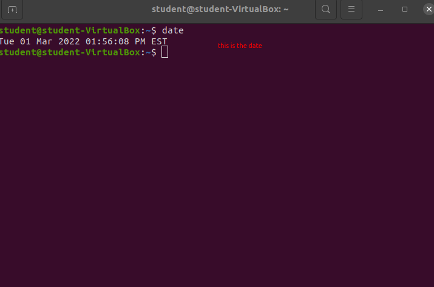
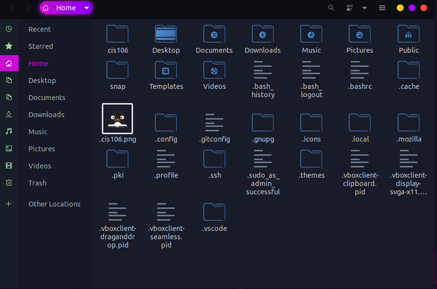
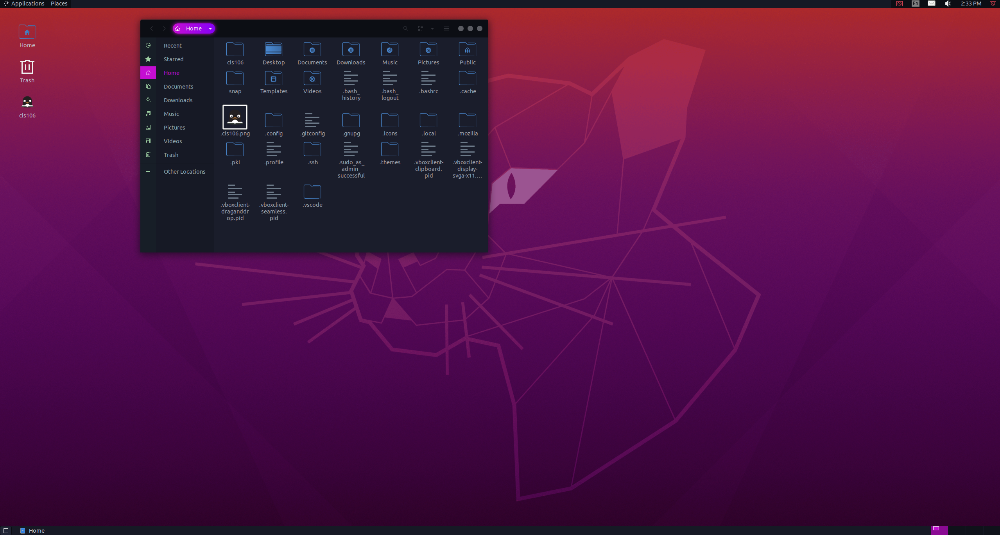

# Lab 3 Using Ubuntu

# Question 1

# Question 2

# Question 3

| Program Purpose     | Package Name        | Version    | Description                                                 |
|---------------------|---------------------|------------|-------------------------------------------------------------|
| Play a tetris game  | quadrapassel        | 1:3.36.0-1 | tetris game                                                 |
| Play a video file   | dragonplayer        | 4:19.12.30 | simple video player                                         |
| Browse the internet | torbrowser-launcher | 0.3.2      | helps download and run the Tor Browser Bundle               |
| Read your email     | thunderbird         | 1:91.5.0   | Email, RSS and newsgroup client with integrated spam filter |
| Play music          | quodlibet           | 4.2.1-1    | audio library manager and player for GTK3                   |

commands Answers:
* Sub question 1: `sudo apt-get install quadrapassel dragonplayer torbrowser-launcher thunderbird quodlibet`
* Sub question 2: `sudo apt-get remove quadrapassel dragonplayer torbrowser-launcher thunderbird quodlibet`
* Sub question 3: `sudo apt install quadrapassel+ dragonplayer+ torbrowser-launcher- thunderbird- quodlibet-`

# Question 4
| command | what it does                                        |
|---------|-----------------------------------------------------|
| echo    | display a line of text                              |
| fortune | print a random, hopefully interesting, adage        |
| cowsay  | configurable speaking/thinking cow (and a bit more) |
| lolcat  | rainbow coloring for text                           |
| figlet  | makes text in a cool format                         |
| toilet  | display large colourful characters                  |
| rig     | Random Identity Generator                           |