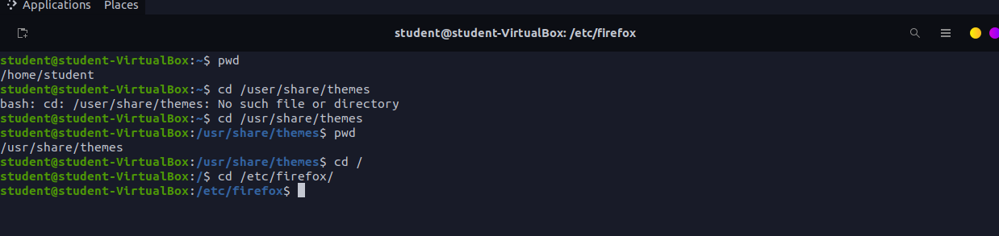
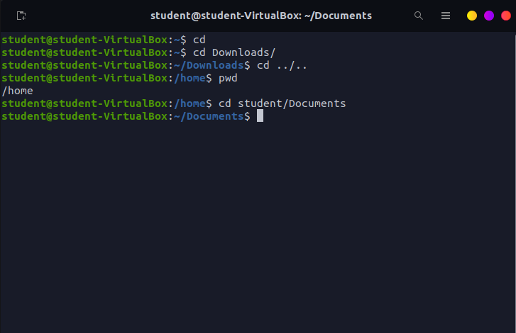
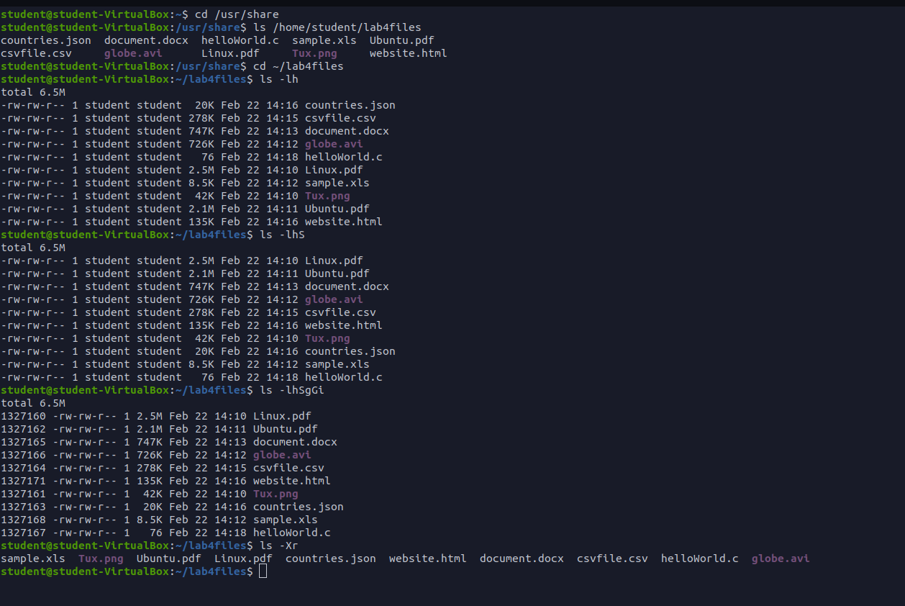
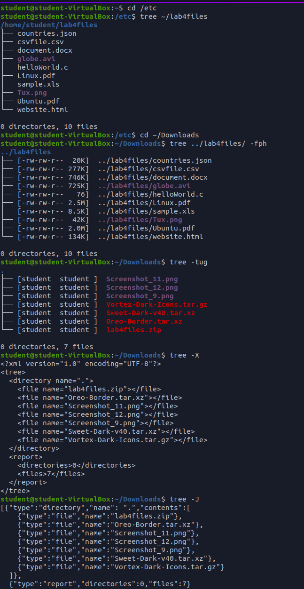
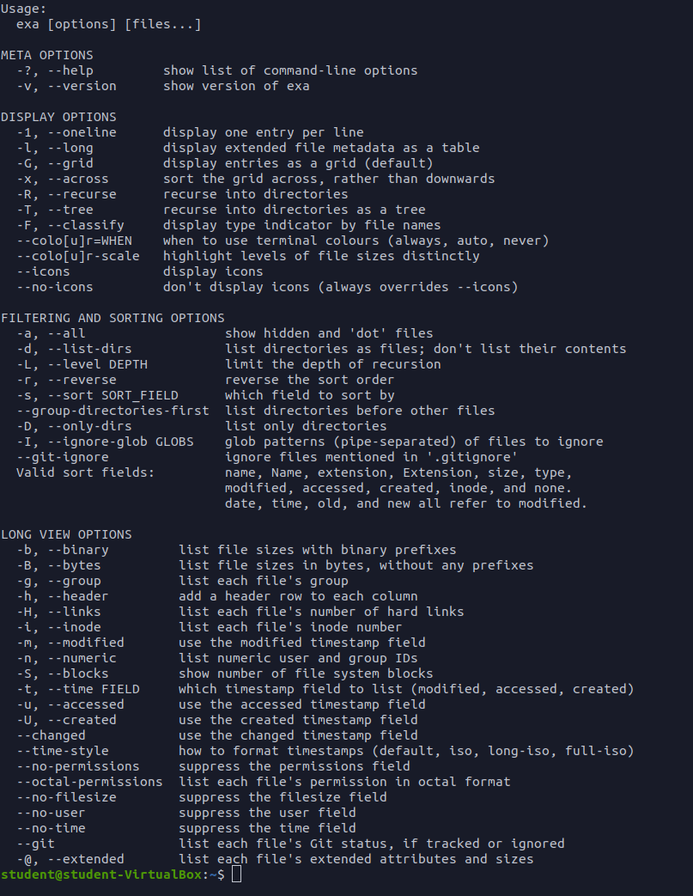
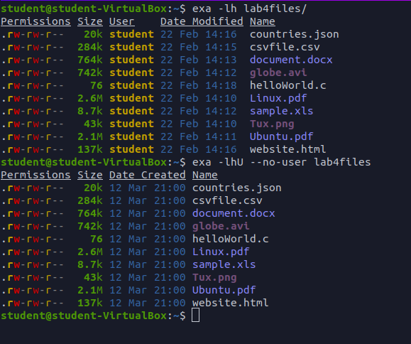

# Lab 4 The Linux fs

## Question 1
### Table 1

| **Directory** | **Function**                                                   |
|---------------|----------------------------------------------------------------|
| bin           | essential commands                                             |
| dev           | device files                                                   |
| etc           | system config files                                            |
| home          | user home directory                                            |
| media         | mounting point for removable media                             |
| opt           | add on software packages                                       |
| proc          | kernel information                                             |
| srv           | files that have information on services that run on the system |
| usr           | nonessential software                                          |
| var           | variable data                                                  |

### Table 2

| **Command** | **What it does**                       | **Syntax**              | **Example**       |
|-------------|----------------------------------------|-------------------------|-------------------|
| cd          | changes the directory to a location    | cd + location           | cd $HOME          |
| pwd         | lists current working directory        | pwd                     | pwd               |
| ls          | lists files and folders in a directory | ls + option + directory | ls -a ~/Downloads |

## Question 2

## Question 3

## Question 4

## Question 5

