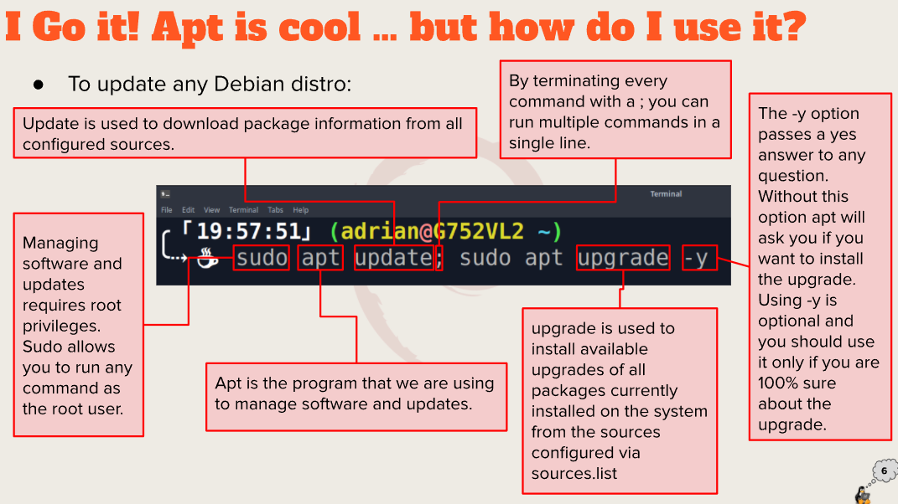

# Week Report 3

# Question 1: Exploring Desktop Environments

**a.** 
Examples of Linux desktop environments as given in the presentation are:
- GNOME
- KDE
- XFCE
- MATE
- BUDGIE
- LXDE
- Cinnamon
- Openbox
- LXQT
- Pantheon
- Deepding DE
- Fluxbox

**b.**
GUI (graphical user interface): programs that allow the user to use a computer with graphical aspects like icons

DE (desktop environment): programs running on an operating system that share a GUI.

**c.**
The common elements of a desktop environment are:
- Icons - represents a program or file
- Panels - rectangle areas that can be configured to display various info such as notifications or the time
- File Manager - allows for manipulating files graphically
- Launcher - lets the user search for programs and files
- Window Manager - controls how windows appear on the desktop and manipulates their size, position, etc
- Desktop Settings - allows the user to configure the environment
- Display Manager - lets you choose between users and the desktop environment
- Favorites Bar - contains icons and programs that are used often
- Menus - opened by an icon and contain files or sublists of files
- System Tray - allows a user to do system operations like shutdown or logging out
- Widgets - provide information on the desktop

# Question 2: The Bash Shell

**a.**
A shell is what allows a user to access and interact with an operating system and its services.

**b.** 
Different shells exist such as:
- Tcsh Shell
- Csh Shell
- Ksh Shell
- Zsh Shell
- Fish Shell

**c.**
Some bash shell shortcut commands include:
- Ctrl + A - move to start of command line
- Ctrl + Y - paste text that was cut using another shortcut
- Ctrl + F - move forward a character
- Alt + B - move backward a word
- Alt + F - move forward a word
- Alt + U - capitalize word starting at the cursor till its end

**d.**
Basic bash commands include:
- !! - run last
- !$ - last word of the previous command
- !blah - run the last command that starts with blah
- !* - run the previous command minus the last word

# Question 3: Managing Software

**a.**
sudo apt update; sudo apt upgrade

**b.**
sudo apt install (name of software here)

**c.**
sudo apt remove (name of software here)

**d.**
apt search (name of software or "search term")
or
apt search -n (name of software) for searching by name

**e.**
Package - archives that hold software, config files, and information about dependencies
Library - code that can be used by functions and programs
Repository - collection of software that can be downloaded

**f.**

